# System Architecture

## Overview

This document provides a visual representation of the lastplateprod system architecture, including authentication flows, monitoring, and infrastructure components.

---

## High-Level Architecture

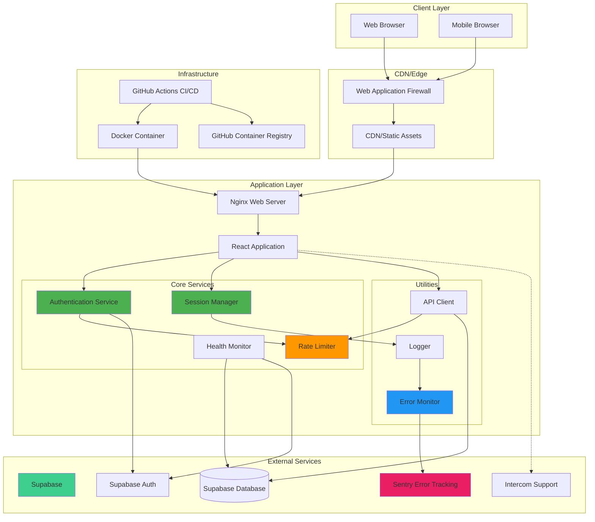

---

## Authentication Flow

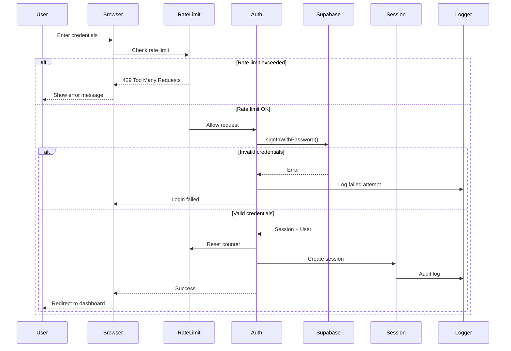

---

## Session Management Flow

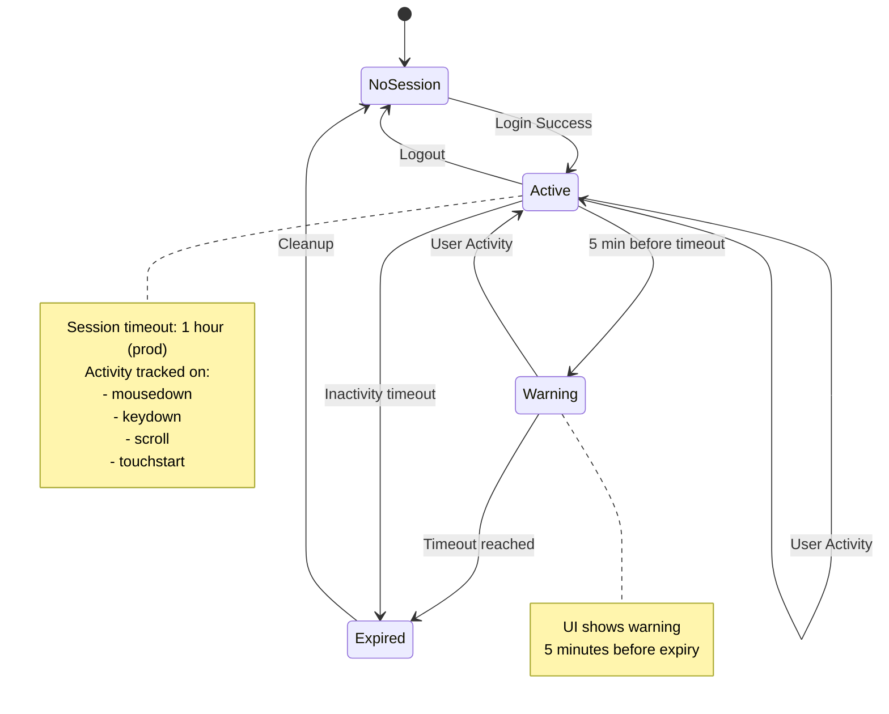

---

## Error Monitoring Flow

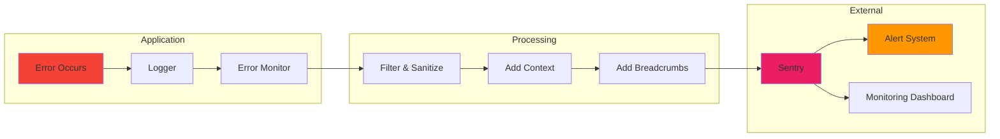

---

## Health Check System

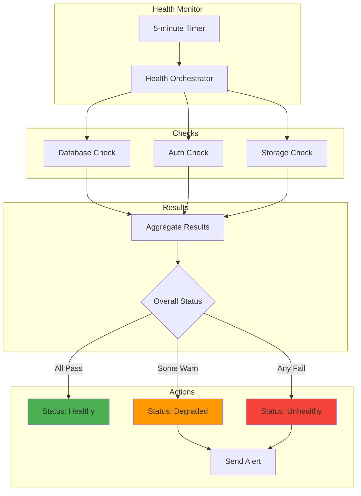

---

## CI/CD Pipeline

```mermaid
graph LR
    subgraph "Trigger"
        Push[Git Push]
        PR[Pull Request]
    end
    
    subgraph "CI Pipeline"
        Checkout[Checkout Code]
        Lint[Lint & Type Check]
        Audit[Security Audit]
        Trivy[Trivy Scan]
        Build[Build Application]
    end
    
    subgraph "Docker Pipeline"
        DockerBuild[Build Docker Image]
        ImageScan[Scan Image]
        SBOM[Generate SBOM]
        Push2[Push to GHCR]
    end
    
    subgraph "Deployment"
        Deploy[Deploy to Production]
        HealthCheck[Health Check]
        Rollback{Success?}
    end
    
    Push --> Checkout
    PR --> Checkout
    
    Checkout --> Lint
    Lint --> Audit
    Audit --> Trivy
    Trivy --> Build
    
    Build --> DockerBuild
    DockerBuild --> ImageScan
    ImageScan --> SBOM
    SBOM --> Push2
    
    Push2 --> Deploy
    Deploy --> HealthCheck
    HealthCheck --> Rollback
    
    Rollback -->|Yes| Complete[Complete]
    Rollback -->|No| Revert[Revert Deployment]
    
    style Trivy fill:#2196F3
    style ImageScan fill:#2196F3
    style Rollback fill:#FF9800
```

---

## Data Flow

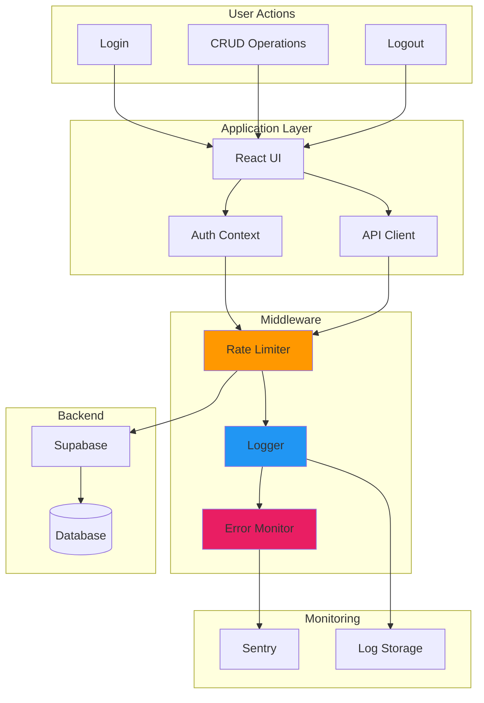

---

## Component Architecture

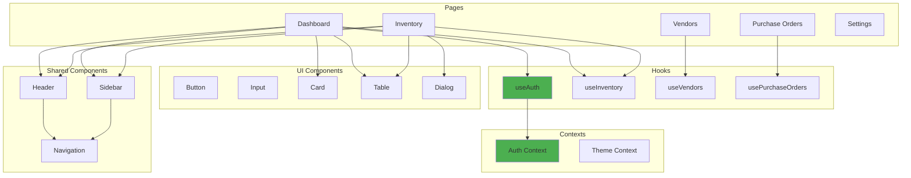

---

## Security Layers

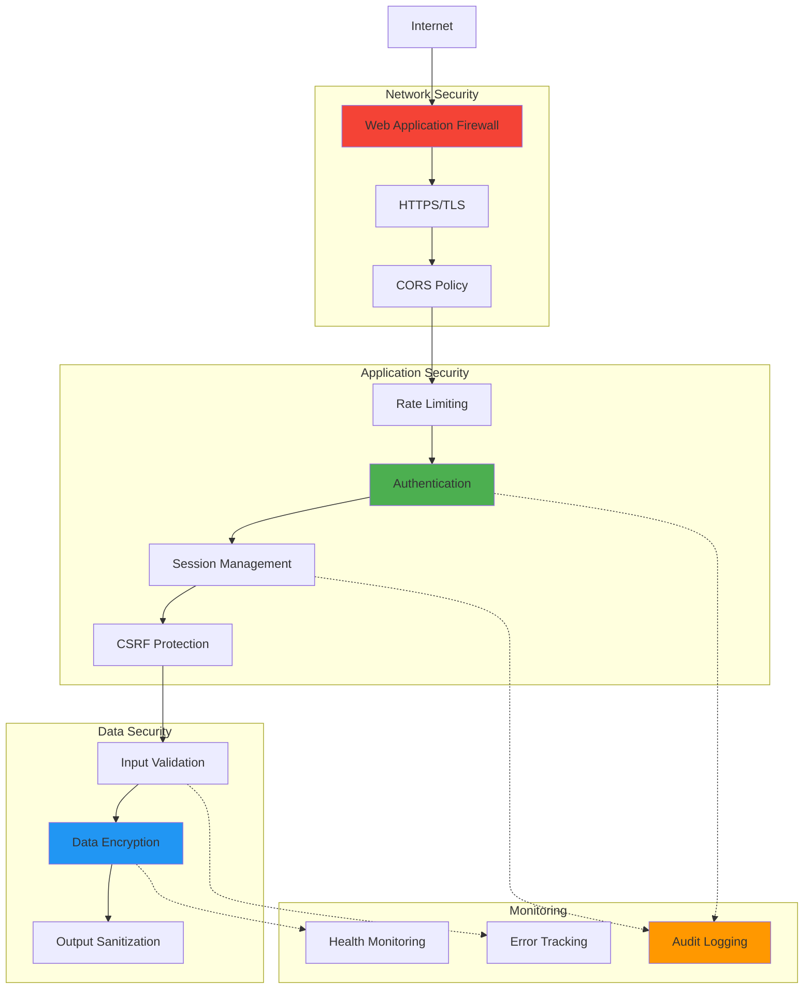

---

## Deployment Architecture

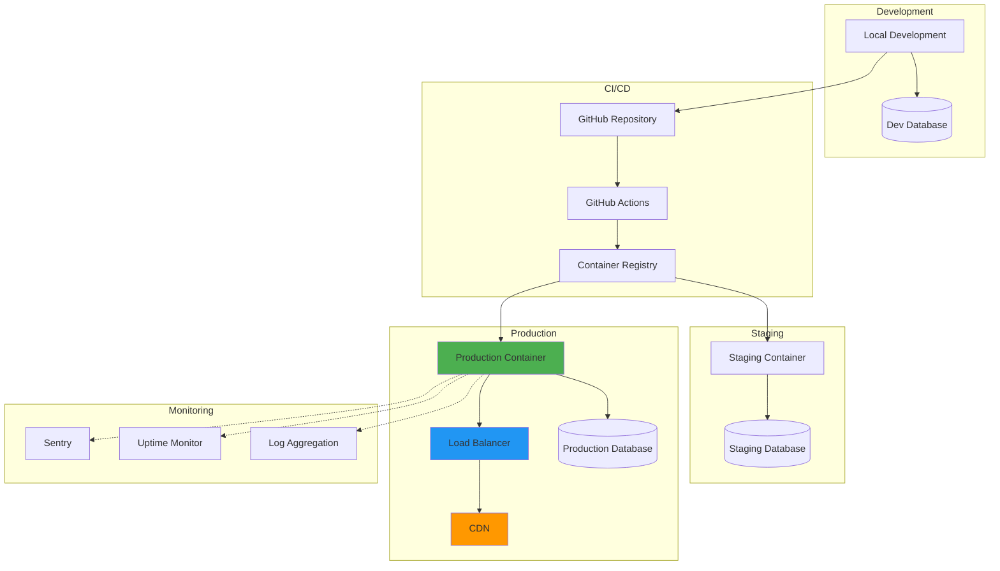

---

## Technology Stack

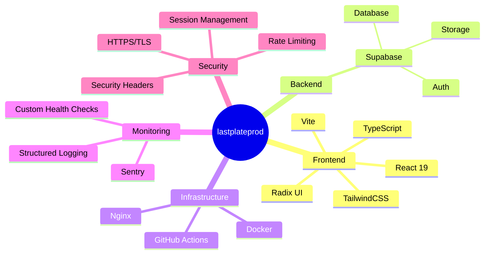

---

## Request Lifecycle

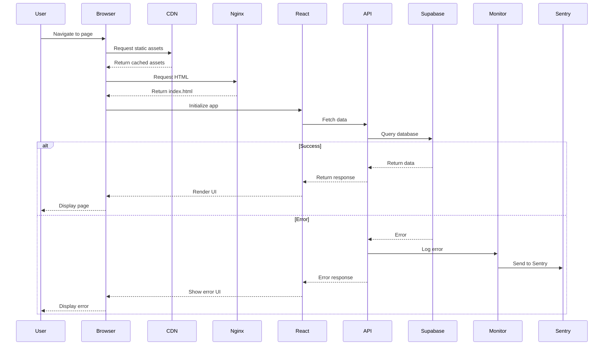

---

## Key Features

### Authentication
- Supabase Auth integration
- JWT token management
- Rate limiting (5 attempts per 15 minutes)
- Session timeout (1 hour production)

### Monitoring
- Sentry error tracking
- Structured logging
- Health checks every 5 minutes
- Audit logging for security events

### Security
- HTTPS/TLS encryption
- Security headers (CSP, X-Frame-Options, etc.)
- Rate limiting on all endpoints
- Session management with timeout
- Input validation and sanitization

### Performance
- CDN for static assets
- Gzip compression
- Multi-stage Docker builds
- Lazy loading of monitoring libraries
- Request timeout and retry logic

---

## Scalability Considerations

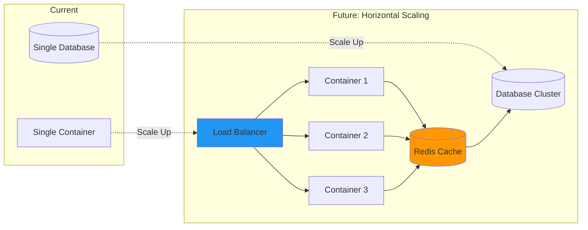

---

## Documentation

- **PRODUCTION_READY_SUMMARY.md** - Production readiness overview
- **PRODUCTION_FEATURES_IMPLEMENTED.md** - Feature documentation
- **PRODUCTION_SECURITY_IMPLEMENTATION.md** - Security guide
- **DEPLOYMENT.md** - Deployment instructions
- **ARCHITECTURE.md** - This document

---

**Last Updated:** 2025-12-14  
**Version:** 2.0.0
